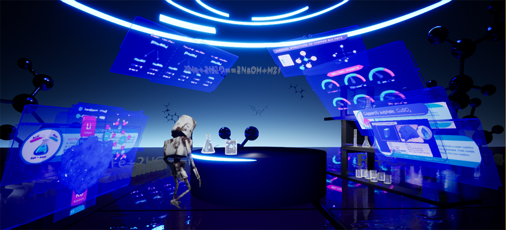
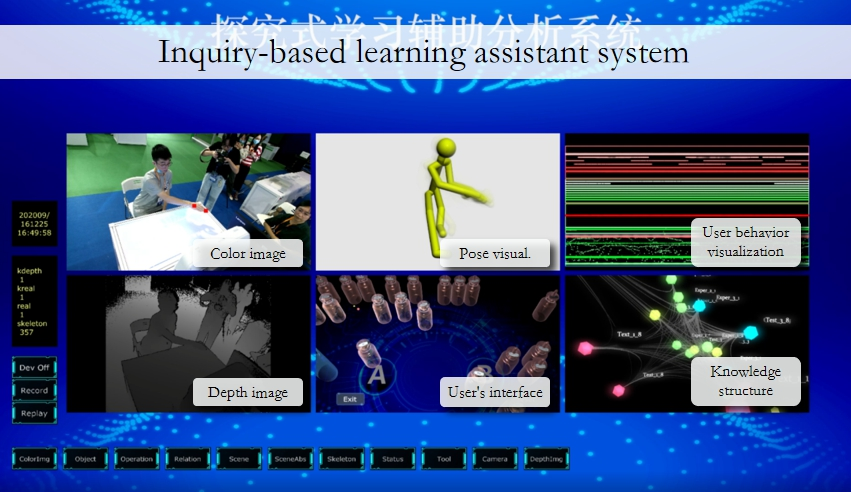
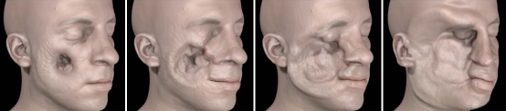
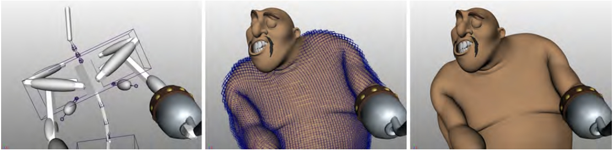
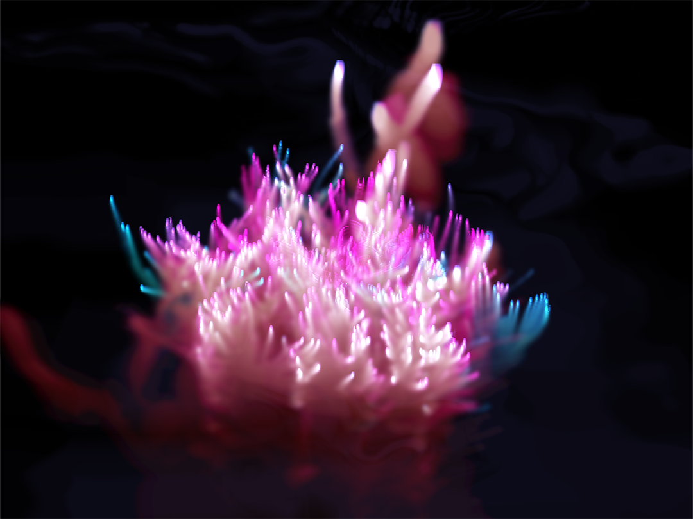
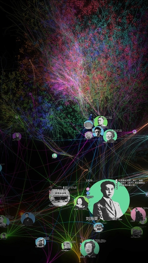
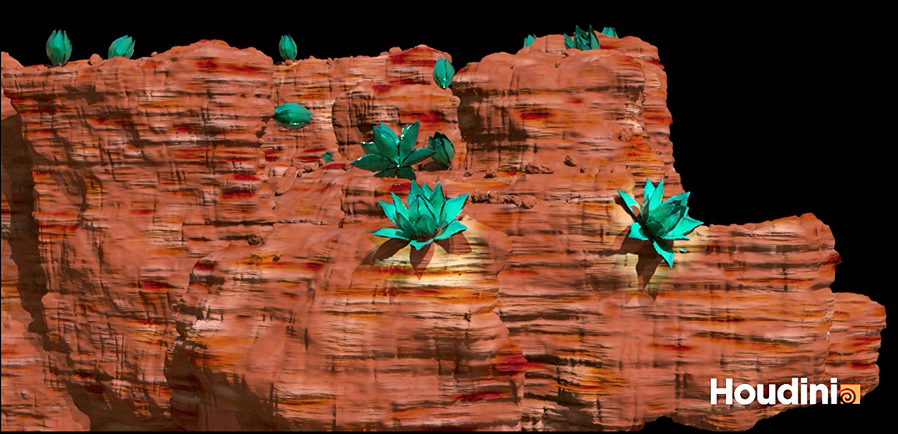

<link rel="stylesheet" type="text/css" href="styles.css">

朱永宁
====

<small><a href="http://kfyaya.github.io/YZhu">En</a></small>

物理模拟算法开发，[FLIP流体模拟](https://www.fxguide.com/fxfeatured/the-science-of-fluid-sims/)开创者。

梦工厂几何与视觉效果工程师，参与《驯龙高手II》流体模拟系统，《魔法精灵》毛发系统，《守护者联盟》与《疯狂原始人》特效研发。

交互媒体艺术教育者，开设[Unreal Engine](https://www.unrealengine.com), [Houdini](https://www.sidefx.com
), [TouchDesigner](https://derivative.ca) and [Processing](https://derivative.ca)课程，致力于提供虚拟现实，增强现实和混合现实解决方案

VR/MR/元宇宙
====

虚实融合探究式学习系统开发平台

[Y.Zhu et al., "An Interactive Mixed Reality Platform for Inquiry-Based Education," 2021 IEEE 7th International Conference on Virtual Reality (ICVR), 2021, pp. 324-331](https://ieeexplore.ieee.org/document/9483827)

[G.Ting, W. Jianmin, Z. Yongning and C. Qiuyu, "Research on Interaction Design of Chemical Inquiry Virtual Experiment Based on Augmented Reality Technology," 2021 IEEE 7th International Conference on Virtual Reality (ICVR), 2021, pp. 340-351](https://ieeexplore.ieee.org/document/9483706)

敦煌研究院科研成果在莫高窟洞窟中的浸入式展示

[S. Du, T. Ge, J. Pei, J. Wang, C. Yin and Y. Zhu, "Panoramic Fluid Painting," 2019 IEEE Conference on Virtual Reality and 3D User Interfaces (VR), 2019, pp. 904-905](https://youtu.be/upvl0Jtjzso)

全景球面上的流体动力学模拟和水墨绘画系统

物理仿真和物理动画
====

[Y. Zhu and R. Bridson. 2005. Animating sand as a fluid. ACM Trans. Graph. 24, 3 (July 2005), 965–972.](https://dl.acm.org/doi/10.1145/1073204.1073298)

该工作开创了[FLIP](https://www.fxguide.com/fxfeatured/the-science-of-fluid-sims/?msclkid=df1cb0e3d0f011ec81010e488da621ec) 流体模拟，该方法应用于Maya Bifrost，Houdini FLIP以及著名特效工作室Double Negative的SQUIRT系统。结合粒子模拟的灵活性和网格快速解法，推动实时流体仿真的实现。该工作应用于电影[《阿凡达》](https://www.fxguide.com/fxfeatured/the_tech_behind_the_tools_of_avatar_part_2_naiad/), [《超级战舰》](https://www.fxguide.com/fxfeatured/battleship-tactical-water-and-fluid-sims/),《哈利波特和混血王子》等特效电影和《质量效应3》等游戏。

[Y.Zhu, E. Sifakis, J. Teran, and A. Brandt. 2010. An efficient multigrid method for the simulation of high-resolution elastic solids. ACM Trans. Graph. 29, 2, Article 16 (March 2010), 18 pages.](https://dl.acm.org/doi/10.1145/1731047.1731054)

&copy; Disney Enterprise Inc.

[A.McAdams et al. 2011. Efficient elasticity for character skinning with contact and collisions. ACM Trans. Graph. 30, 4, Article 37 (July 2011), 12 pages.](https://dl.acm.org/doi/10.1145/2010324.1964932)

精细动画人物的肌肉模拟耗时巨大，动画制作中需要实现具有特定艺术设计要求的夸张形变的拉伸与挤压。多重网格方法在均匀网格和常规Neo-Hookean材质弹性形变方程方面提出了快速方法。针对拉伸压缩(Squash and stretch)中收缩和挤出现象所需的近似不可压缩材质导致的系统病态问题提出了解决方法，实现了接近理论结果的一致性的收敛速率。人物动画中模型碰撞同时得到自动结算，节省了大量人力资源。

音画交互
====

对话2.0, 2021, 同济大学

对话2.0, 2021, 同济大学(Coming soon......)

水彩泼成的黄河，锦心绣成的黄河，精诚拱卫的黄河，哪一个是你心中的黄河？
水深云际的春江，花影层叠的春江，金波闪烁的春江，谁才是你梦里的春江？
算法生成与艺术设计，红色经典与江南软哝，音乐表演与沉浸式新媒体艺术碰撞出怎样的火花？
对话2.0——古典琴韵与红色经典

[对话1.0](https://mp.weixin.qq.com/s/vcA09qC7PdqaqlnhkXyuGQ), 上海之春国际音乐节, 2020

Manjusaka, 2019.05, MIFA 1862, Shanghai

Digital Humanity
====

上海图书馆历史人文大数据平台整理记录了上百万条历史人物，事件信息，并通过人文调查科学研究对它们的内容，属性，关系进行信息标定。我们在沉浸式虚拟空间对数据进行挖掘和可视化重现，展示数据库的容量内涵，复杂性和可用性。

交互舞蹈
====

[两仪万象](https://youtu.be/upvl0Jtjzso), 2016.03, 同济大学德国音乐周

[《希望是长者羽毛的——皮囊》](https://youtu.be/upvl0Jtjzso), 2016.05, 苏州文化艺术中心，多媒体设计，2017年旧金山国际艺术节邀约作品

教学
====
同济大学交互程序设计与新媒体互动影像艺术课程作品，所用软件包括 [Unreal Engine](https://www.unrealengine.com), [Houdini](https://www.sidefx.com
), [TouchDesigner](https://derivative.ca) and [Processing](https://processing.org).

* [2018 暑期工坊](https://mp.weixin.qq.com/s/vcA09qC7PdqaqlnhkXyuGQ)
* [2019 student works](https://www.manamana.net/video/detail?id=58733#!en).
* [2020 student works](https://mp.weixin.qq.com/s/XJS4VDbDi-yE0CIwLGko3g)

Yining Chen

Ziyan Tang

Mingxuan Zhang

Jun Cao

Yibo Wang

Yiling He

课程信息
====
https://github.com/kfyaya/TouchDesigner-lecture

Other tests(Coming soon......)
====
