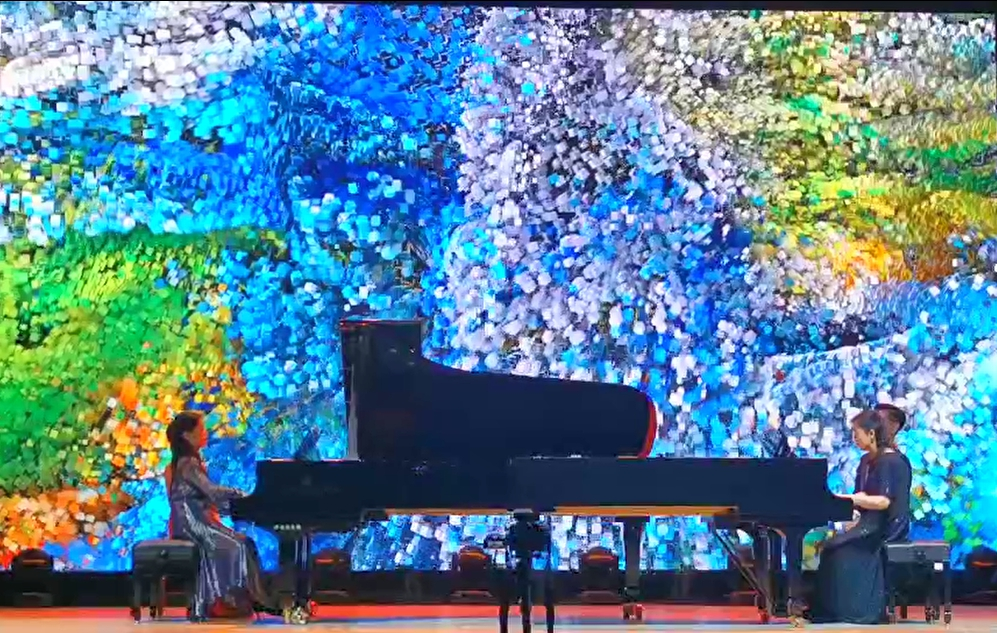
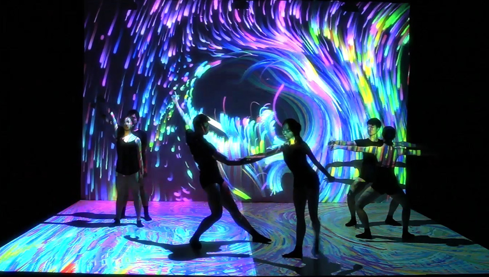
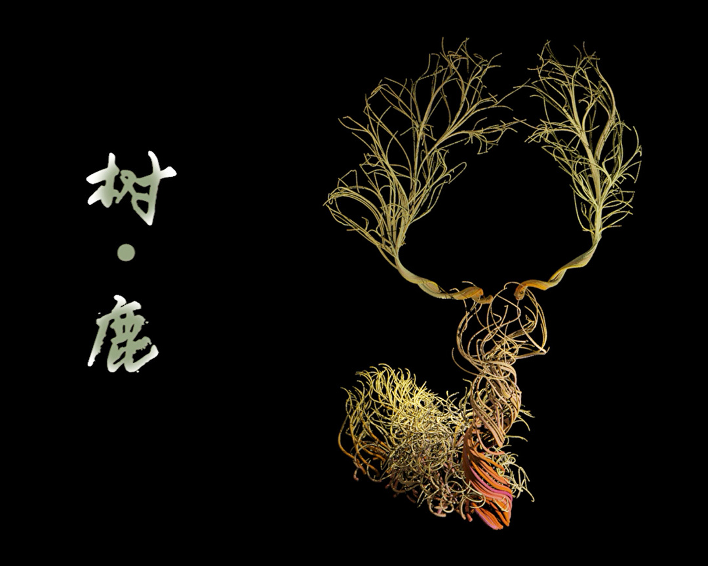

Yongning Zhu 
====
<small><a href="README-zh.html">中文</a></small>

Physics-based Animation algorithm developer, credited for the FLIP fluid simulation ( [fxguide] (https://www.fxguide.com/fxfeatured/the-science-of-fluid-sims/) )and [multigrid character simulation](https://www.youtube.com/watch?v=0WfFCqKDLB0)

Computer graphics and visual effects software engineer in DreamWorks Animation, joined in How to Catch your Dragon II, Troll, Rise of the Guardians, and Croods

And interactive media art professor at Tongji University, teaching [Unreal Engine](https://www.unrealengine.com), [Houdini](https://www.sidefx.com
), [TouchDesigner](https://derivative.ca) and [Processing](https://derivative.ca).

Persistently seeking for procedural solutions utilizing computer graphics and visual effects techniques to build up sustainable visualization solutions in mixed reality solutions for scientific visualization, public media space, interactive performance, and a variaty of digital humanity fields. 

VR/MR/MetaVerse
====

[Y.Zhu et al., "An Interactive Mixed Reality Platform for Inquiry-Based Education," 2021 IEEE 7th International Conference on Virtual Reality (ICVR), 2021, pp. 324-331](https://ieeexplore.ieee.org/document/9483827)
Inquiry-based teaching is a methodology promoting the students‘ active learning, learning interest and performance. The students are immersed in a personalized virtual learning environment surrounded by knowledge cards arranged by the knowledge management system. 

[G.Ting, W. Jianmin, Z. Yongning and C. Qiuyu, "Research on Interaction Design of Chemical Inquiry Virtual Experiment Based on Augmented Reality Technology," 2021 IEEE 7th International Conference on Virtual Reality (ICVR), 2021, pp. 340-351](https://ieeexplore.ieee.org/document/9483706)

Revealing [Dunhuang research](http://www.dha.ac.cn/) embedded in the immersive virtual replica of Mogao Grottoes.

[S. Du, T. Ge, J. Pei, J. Wang, C. Yin and Y. Zhu, "Panoramic Fluid Painting," 2019 IEEE Conference on Virtual Reality and 3D User Interfaces (VR), 2019, pp. 904-905](https://ieeexplore.ieee.org/document/8798200/) 
By solving Navier-Stokes equations on the panoramic sphere, you can directly paint the VR background with dynamic fluid painting effects and a variety of features including watercolor and oil painting.

Physics-based simulation
====

[Y. Zhu and R. Bridson. 2005. Animating sand as a fluid. ACM Trans. Graph. 24, 3 (July 2005), 965–972.](https://dl.acm.org/doi/10.1145/1073204.1073298)

This work pioneers the [FLIP fluid simulation](https://www.fxguide.com/fxfeatured/the-science-of-fluid-sims/) method used in softwares including Maya Bifrost and Houdini FLIP solver, and studio tools including SQUIRT from Double Negative Visual Effects. By combining the topological flexibility in particle simulation and spatial uniformity and efficiency in grid solver, fluid simulation is now affordable in real-time scenario. This technique is also used in movies including [Avatar](https://www.fxguide.com/fxfeatured/the_tech_behind_the_tools_of_avatar_part_2_naiad/), [Battleship](https://www.fxguide.com/fxfeatured/battleship-tactical-water-and-fluid-sims/), Alice in Wonderland, and games including Mass Effects 3 and now becomes one of the main fluid simulation frameworks. 

[Y.Zhu, E. Sifakis, J. Teran, and A. Brandt. 2010. An efficient multigrid method for the simulation of high-resolution elastic solids. ACM Trans. Graph. 29, 2, Article 16 (March 2010), 18 pages.](https://dl.acm.org/doi/10.1145/1731047.1731054)

Multigrid methods are wellknown as a fast solver for elasticity problems. However, for near-incompressible materials, required in the simulation of bulging and stretching effects in animation, the problem becomes ill-posed. We introduced a solution with continuation even to the extreme of animation exageration, and demonstrated its applicability to arbitrary articulated characters. 

&copy; Disney Enterprise

[A.McAdams et al. 2011. Efficient elasticity for character skinning with contact and collisions. ACM Trans. Graph. 30, 4, Article 37 (July 2011), 12 pages.](https://dl.acm.org/doi/10.1145/2010324.1964932)

Destruction fragments are missing in the Finite Element simulation of earthquake destruction due to the element fracture and ill-conditioning. Rigid body dynamics are used to reconstruct and continue the simulation of broken fractures and recover the debris extention. 

Audio Visualization
====

[Dialogue 2.0, 2021](https://m.bilibili.com/video/BV1aU4y1R7nC), [The Paper news report](https://www.thepaper.cn/newsDetail_forward_18644869), [Preview](https://mp.weixin.qq.com/s/80_oqWyzYdLh3vLucJFi9A), Tongji

Water color pouring，silk embroidery, and abstract geometry, depict the impressions of the holy mother river. 
In the misty moonlight, by the colorful flowers, with shimmering ripples, appears the dreamy spring river.

Historical epic and traditional rhythm, music performance and immersive new media art, generative algorithm and artistic design
join to present our new media art Concert: Dialogue 2.0

[Dialogue](https://mp.weixin.qq.com/s/vcA09qC7PdqaqlnhkXyuGQ), Shanghai Spring Music Festival, 2021

Manjusaka, 2019.05, MIFA 1862, Shanghai

Digital Humanity
====

Digital Humanities Platform in Shanghai library keeps nearly a million records about historical characters and events. These characters and events are marked by the researchers with their humanity values, classes, keywords, and relationships with other items. Our visualization builds up a hierarchical structure in the immersive virtual world to reveal the compacity, complexity and availability of this database. 

Interactive Dance
====

[Yin and Yang](https://youtu.be/upvl0Jtjzso), 2016.03, Interactive dance performance, Tongji University

[Hope is the Thing with Feathers - II, No More than Skins](https://youtu.be/upvl0Jtjzso), 2016.05, Suzhou Culture and Arts Center, invited by San Francisco International Arts Festival. 

Student works
====
I have been teaching Interactive Programming and New Media Art in Tongji University mainly with Houdini, TouchDesigner and Unreal Engine. Here is a collection of the student works:
* [2018 student works in Shanghai Spring International Music Festival](https://mp.weixin.qq.com/s/vcA09qC7PdqaqlnhkXyuGQ)
* [2019 student works](https://www.manamana.net/video/detail?id=58733#!en).
* [2020 student works](https://mp.weixin.qq.com/s/XJS4VDbDi-yE0CIwLGko3g)

[爱在人间Ode to Love](https://mp.weixin.qq.com/s/2Xwh0ZZTXTa1QkkMOsRa7g)
谢佳璇Jiaxuan Xie

陈奕宁Yining Chen

唐子燕Ziyan Tang

张明轩Mingxuan Zhang

曹峻Jun Cao

Cliff with lotus - generated from ridgeline curves - 王奕博Yibo Wang 

Tree or deer? - 何奕凌Yiling He

Course Information
====
https://github.com/kfyaya/TouchDesigner-lecture

Other tests(Coming soon......)
====
